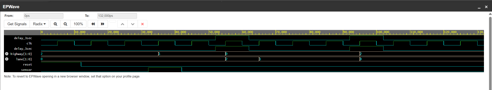

# Controller-for-Traffic-Signals
## Overview

This project implements a simple traffic light controller using a finite state machine (FSM) in Verilog. The design manages two directions (highway and lane) and transitions through green, yellow, and red states based on sensor input and a delay timer.

This repository contains a Verilog implementation of a traffic light controller FSM, along with a SystemVerilog testbench for simulation. The FSM controls traffic lights for a highway and a side lane, transitioning states based on a vehicle sensor and a programmable delay
## Features

- FSM-based traffic light control for two directions (highway and lane)
- Four states: 
  - Highway Green / Lane Red
  - Highway Yellow / Lane Red
  - Highway Red / Lane Green
  - Highway Red / Lane Yellow
- Sensor input to detect vehicles on the side lane
- Programmable delay for yellow and green phases
- Testbench with simulation stimulus and VCD waveform dump
- 
## File Structure

| File         | Description                              |
|--------------|------------------------------------------|
| traffic_light_fsm.sv   | Verilog module for the traffic light FSM |
| tb_traffic_light_fsm.sv| SystemVerilog testbench for simulation   |

## How It Works

- The FSM starts in the "Highway Green / Lane Red" state.
- If a car is detected on the side lane (`sensor` input), the FSM transitions to "Highway Yellow / Lane Red" after a programmable delay.
- The FSM continues through the sequence, allowing the lane to go green, then yellow, and finally returning to the default state.
- State transitions are controlled by the `sensor` and `delay_3sec` inputs.

### State Encoding

| State Name                | Encoding |
|---------------------------|----------|
| HW_GREEN_LANE_RED         | 3'b000   |
| HW_YELLOW_LANE_RED        | 3'b001   |
| HW_RED_LANE_GREEN         | 3'b010   |
| HW_RED_LANE_YELLOW        | 3'b011   |

## Simulation Instructions

1. Open both `design.sv` and `testbench.sv` in your Verilog simulator.
2. Run the simulation.
3. The testbench will:
   - Initialize signals
   - Apply stimulus to simulate cars arriving on the lane
   - Dump waveforms to `dump.vcd` for viewing in a waveform viewer

## Example Waveform Output

Below is a sample waveform generated from the simulation, visualized using EPWave:

**Signal Description:**
- `delay_3sec` and `delay_3sec` (duplicated): Show the timing pulse for state transitions.
- `_clk`: The clock signal driving the FSM.
- `highway[1:0]`: Output for the highway traffic light (e.g., 2 = green, 1 = yellow, 0 = red).
- `lane[1:0]`: Output for the lane traffic light (e.g., 2 = green, 1 = yellow, 0 = red).
- `reset`: System reset signal.
- `sensor`: Input signal indicating a vehicle is present on the lane.

**Waveform Analysis:**
- When `sensor` is asserted, the FSM progresses through the states, changing the output of `highway` and `lane` accordingly.
- The `delay_3sec` signal synchronizes the transition timing for yellow and green phases.
- The `reset` signal initializes the FSM to its default state.
- Observe that `highway` and `lane` outputs change in a mutually exclusive pattern, ensuring safe traffic control.

You can view the waveform output using any VCD-compatible viewer (e.g., GTKWave). The signals of interest are:

- `state` (FSM state)
- `highway` (highway light outputs)
- `lane` (lane light outputs)
- `sensor` (vehicle detection)
- `delay_3sec` (delay timer)
